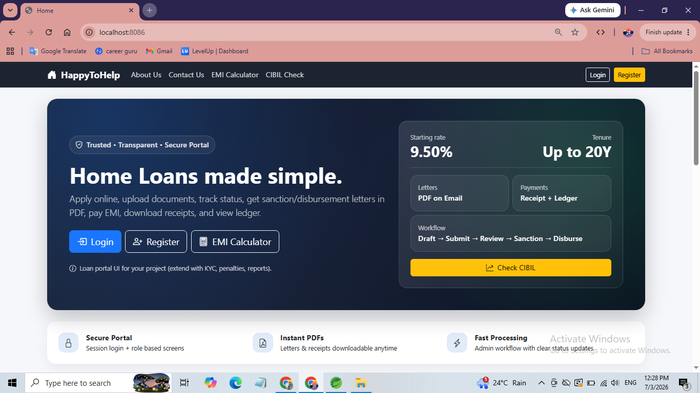
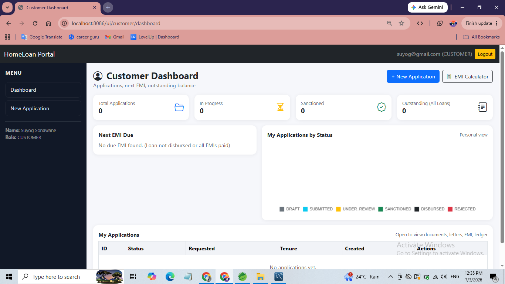
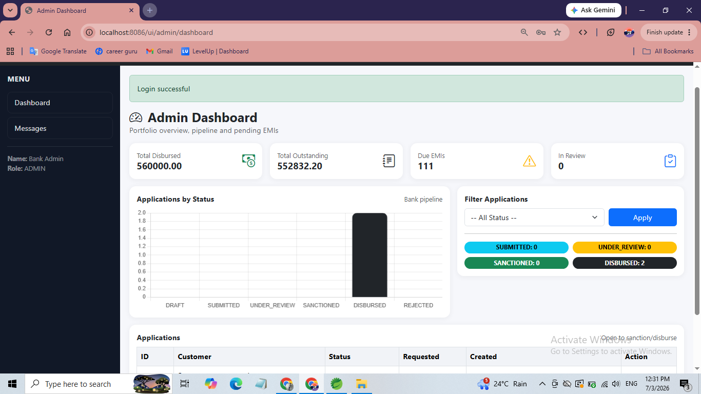
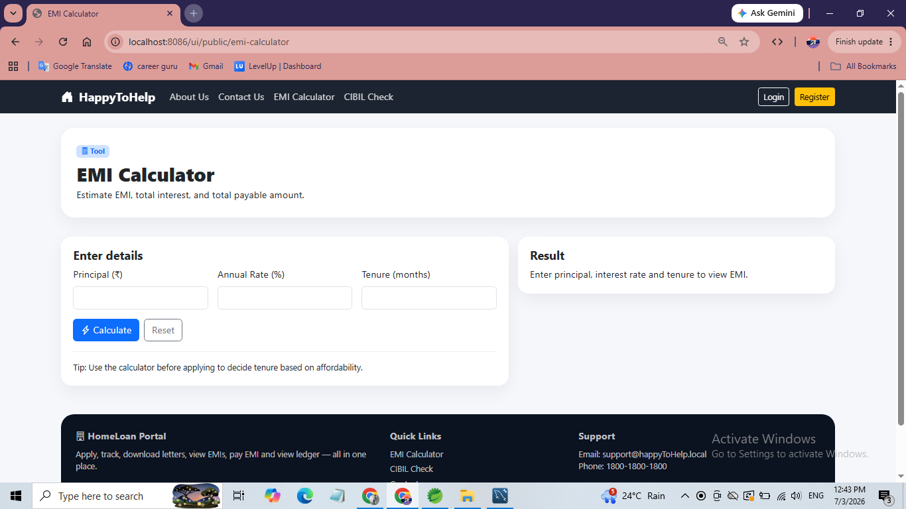
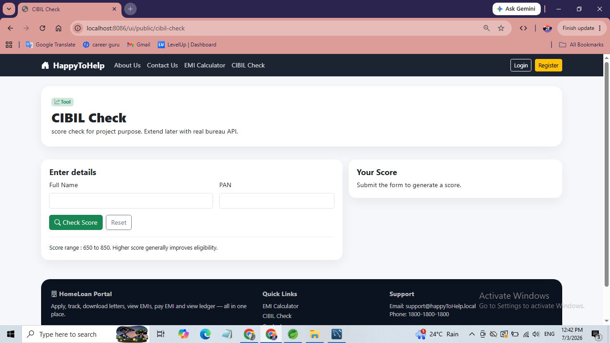
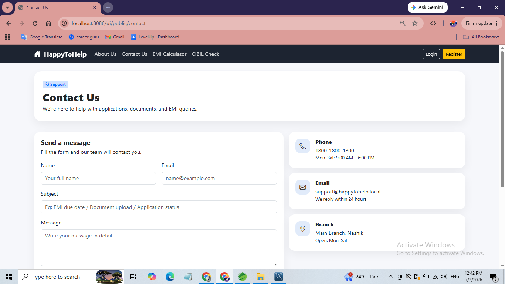

# 🏠 HappyToHelp Finance – Home Loan Application Portal

A complete web-based **Home Loan Management System** that digitalizes the end-to-end loan lifecycle — from application submission to EMI repayment tracking — for both customers and bank administrators.

 **Developed by:** Sonawane Suyog 

---

## 📌 About the Project

Traditional home loan processing relies on manual paperwork, repeated branch visits, and phone-call status updates — leading to delays and low transparency. **HappyToHelp Finance** solves this by providing a secure, session-based web portal where:

- Customers can register, apply for loans, upload documents, track status, pay EMIs, and download official letters/receipts.
- Admins (loan officers) can review, approve/reject, sanction, and disburse loans, with automated PDF letter generation and email delivery.

Built with **Java 17, Spring Boot, Thymeleaf, Bootstrap, and MySQL**, following a clean layered architecture (Controller → Service → Repository → Entity).

---

## ✨ Key Features

### 👤 Customer
- Secure registration & login (session-based)
- Create, save (draft), and submit loan applications
- Upload/download supporting documents
- Track application status: `DRAFT → SUBMITTED → UNDER_REVIEW → SANCTIONED → DISBURSED / REJECTED`
- Auto-generated EMI schedule after disbursement
- Pay EMIs (simulation) and download payment receipts (PDF)
- View loan ledger with running outstanding balance
- Download Sanction & Disbursement letters (PDF)
- Personal dashboard with KPIs and charts

### 🛠️ Admin
- Review, approve/reject applications with remarks
- Sanction loans (amount, interest rate, tenure)
- Disburse loans & auto-generate EMI schedule
- Auto-generate and email Sanction/Disbursement letters via Gmail SMTP
- View and resolve customer support messages
- Dashboard with KPIs and status-distribution charts

### 🌐 Public / Guest
- Home, About Us, Contact Us pages
- EMI Calculator
- Demo CIBIL Score Check
- Contact/support form (stored in DB + email notification)

---

## 🧰 Tech Stack

| Layer            | Technology                                  |
|-------------------|----------------------------------------------|
| Backend           | Java 17, Spring Boot 3.x (Web, Validation, JPA) |
| Frontend / UI      | Thymeleaf, HTML5, CSS3, Bootstrap 5, Chart.js |
| Database           | MySQL 8.x, Spring Data JPA                  |
| PDF Generation     | OpenPDF                                     |
| Email              | Gmail SMTP                                  |
| Build Tool         | Maven                                       |
| Server             | Embedded Tomcat                             |
| IDE                | Spring Tool Suite (STS) / Eclipse           |

---

## 🏗️ Project Modules

1. **Public Website & Utility Module** – Home, About, Contact, EMI Calculator, CIBIL Check
2. **User Authentication Module** – Registration, login, session management, role-based routing
3. **Loan Application Module** – Create & submit loan applications
4. **Loan Eligibility Check Module** – LTV & income/EMI rule validation
5. **Document Management Module** – Upload/download loan documents
6. **Loan Status Tracking Module** – Real-time status visibility
7. **Admin Management & Workflow Module** – Review, approve/reject, sanction, disburse
8. **PDF Letter Generation & Email Module** – Sanction/Disbursement letters via SMTP
9. **EMI Schedule, Payment & Receipt Module** – EMI generation, payment simulation, receipts
10. **Ledger & Outstanding Balance Module** – Transaction-wise ledger with running balance
11. **Reports & Dashboard Module** – KPIs and charts for customers/admins
12. **Support / Contact Message Module** – Query handling and resolution tracking

---

## 🗃️ Database Design (Overview)

| Table              | Purpose                                       |
|----------------------|------------------------------------------------|
| `User`               | Stores customer/admin accounts & roles         |
| `LoanApplication`    | Core loan application data & status            |
| `LoanDocument`       | Uploaded document metadata                     |
| `EmiSchedule`        | Installment-wise EMI breakdown                 |
| `Payment`            | EMI payment records                            |
| `LedgerEntry`        | Disbursement & repayment ledger, running balance |
| `ContactMessage`     | Support/contact queries                        |

---

## ⚙️ Getting Started

### Prerequisites
- JDK 17
- Maven (bundled with STS/Eclipse or standalone)
- MySQL Server 8.x
- Gmail account (for SMTP email — use an App Password)

### Setup

1. **Clone the repository**
   ```bash
   git clone https://github.com/<your-username>/happy-to-help-home-loan.git
   cd happy-to-help-home-loan
   ```

2. **Configure the database**  
   Create a MySQL database and update `src/main/resources/application.properties`:
   ```properties
   spring.datasource.url=jdbc:mysql://localhost:3306/homeloan_db
   spring.datasource.username=root
   spring.datasource.password=yourpassword

   spring.mail.username=your-email@gmail.com
   spring.mail.password=your-app-password
   ```

3. **Build and run**
   ```bash
   ./mvnw clean install
   ./mvnw spring-boot:run
   ```

4. **Access the app**  
   Open your browser at: `http://localhost:8086`

---

## 📸 Screenshots

| Home Page | Customer Dashboard | Admin Dashboard |
|-----------|---------------------|-------------------|
|  |  |  |

| EMI Calculator | CIBIL Check | Contact Us |
|------------------|--------------|-------------|
|  |  |  |


---

## 🚧 Limitations

- Basic role-based access (no advanced RBAC or 2FA/OTP)
- No real integration with credit bureaus (CIBIL check is a demo simulation)
- EMI payments are simulated, not connected to real payment gateways
- Local filesystem storage for documents (no cloud storage/encryption)
- Designed for small–medium scale usage (no microservices/caching/load balancing)

---

## 🚀 Future Enhancements

- Two-factor authentication (2FA) / OTP-based login
- Real CIBIL API and payment gateway integration
- AI/ML-based loan recommendation & risk analysis
- Microservices architecture with cloud deployment
- Cloud-based document storage
- Mobile app (Android/iOS)
- Advanced reporting, analytics, and notification system (SMS/email/push)

---


## 👨‍🎓 Author

**Sonawane Suyog**  


